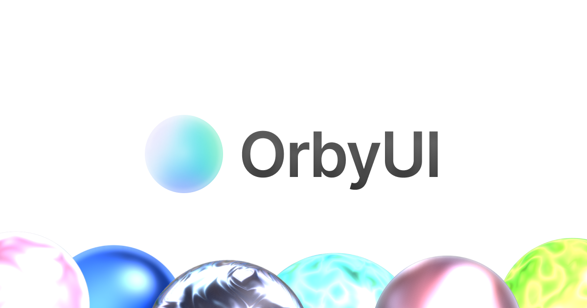

# OrbyUI



Design animated WebGL orbs in the browser, then export them as drop-in snippets
with **no runtime dependencies**.

**[Try it → orby-ui.vercel.app](https://orby-ui.vercel.app/)**

Pick a style, material and mood, tune the shader by hand, and copy a
self-contained component straight into your project. Nothing to install, no
package to track. The export is a single file.

---

## What it does

- **Four orb styles** — Volume, Halo, Plasma, Iris
- **Nine materials** — Energy, Grain, Glass, Frost, Metal, Silk, Liquid, Dither, ASCII
- **Eight presets** — Lumen, Nova, Aurora, Ember, Tide, Prism, Void, Pulse
- **Four states** — Idle, Listen, Think, Speak, each with its own tempo that you can configure
- **Direct shader control** — glow, glass, bloom, chromatic aberration, refraction,
  dispersion, fresnel, noise algorithm, iridescence, pointer follow
- **Motion control** — speed, rotation, distortion, noise speed
- **Your settings persist** to `localStorage` and rehydrate on return

### Export formats

| Format | Save as | Notes |
| --- | --- | --- |
| React | `OrbyUI.tsx` | One component, `react` as the only peer |
| JavaScript | `orby-ui.js` | Mount on any element, zero dependencies |
| HTML | `orby-ui.html` | Open locally or drop on any static host |
| TypeScript | `orby-ui.d.ts` | Typings to sit beside the JS or React file |

The studio copies to your clipboard rather than downloading, so the filenames
above are suggestions — save the snippet wherever suits your project.

Every export is generated in the browser from your current configuration, with
the shader inlined. **Nothing is added to your `package.json`** — the
JavaScript and HTML exports have no dependencies at all, and the React export
needs only the `react` you already have.

---

## Running the studio locally

Only needed to work on OrbyUI itself — using an export requires none of this.

```bash
npm install
npm run dev          # http://localhost:8080
npm run build        # production build
npm run typecheck    # tsc --noEmit
npm test             # node:test
npm run lint         # eslint
```

Works on Windows, macOS and Linux. `dev`, `build` and `preview` all route
through `scripts/with-app-env.mjs`, which merges `.grok/app-env.json` into the
environment so the dev server and the build can never disagree about a flag.

---

## Using an export

### React — `OrbyUI.tsx`

1. **Export → React → copy.**
2. Save as `src/components/OrbyUI.tsx`.
3. The parent must have a size:

```tsx
import { OrbyUI } from "./components/OrbyUI";

<div style={{ width: 420, height: 420 }}>
  <OrbyUI />
</div>
```

4. **Optional props:** `mood`, `light`, `body`, `core`, plus any other config key.
5. **Next.js:** add `"use client"` at the top of `OrbyUI.tsx`.
6. **States:** `<OrbyUI />` on its own is enough — don't pass `mood`. Don't strip
   `MOOD_MUL` / `easePulse` or the pulse block unless you also replace them with
   `pulse = 1` and the raw `config.intensity` / `noiseSpeed` / `distortion`.

### JavaScript — `orby-ui.js`

1. **Export → JavaScript → copy.**
2. Save as `orby-ui.js`.
3. Mount it:

```html
<div id="orby-ui" style="width:420px;height:420px"></div>
<script type="module" src="./orby-ui.js"></script>
```

4. **API:** `createOrbyUI(el, options)`, then `setMood`, `setConfig`, `capture()`,
   `destroy()`.
5. **States:** omit `mood`, `moodSpeed`, `easing` and `spring` from options, and
   don't call `setMood`. Same pulse-block rule as React.

### HTML — `orby-ui.html`

1. **Export → HTML → copy.**
2. Save as `orby-ui.html`. Open it locally or host it as a static file.
3. **Embed:** `<iframe src="/orby-ui.html" style="width:420px;height:420px;border:0">`,
   or paste the `#orby-ui` div and module script into a page you already have.
4. **States:** already running without wiring moods. You can delete `mood`,
   `moodSpeed`, `easing` and `spring` from the inline config; `orb.setMood(...)`
   is optional.

### TypeScript — `orby-ui.d.ts`

Declarations only — no runtime.

1. **Export → TypeScript → copy.**
2. Save it next to `orby-ui.js`.
3. Set `"allowJs": true` in `tsconfig.json`.
4. `import { createOrbyUI, type OrbyUIConfig } from "./orby-ui.js";`
5. Skip this file entirely if you only use the React export.
6. **States:** those fields are already optional on `OrbyUIConfig` — just omit
   them. Don't delete `OrbMood` / `setMood` from the `.d.ts` unless you also
   removed them from the JS.

---

## How it's built

| Layer | Choice |
| --- | --- |
| Framework | TanStack Start · React 19 |
| Styling | Tailwind v4, design tokens in `src/styles.css` |
| Rendering | Custom WebGL renderer — no three.js |
| State | Zustand, persisted to `localStorage` |
| Scrolling | Lenis |

```
src/
  components/studio/    the studio UI — panel, canvas, export dialog
  components/ui/        dialog, tooltip, slider primitives
  lib/orb/              renderer, shaders, presets, codegen, store
  lib/highlight.ts      dependency-free syntax tokeniser
  lib/theme.ts          theme, read from the DOM rather than context
```

Two deliberate choices worth knowing about:

**The orb runs entirely client-side.** No API, no database, no user input
reaches a server. The shader executes on the visitor's GPU.

**No syntax-highlighting library.** The export dialog colours code with a small
in-repo tokeniser (`src/lib/highlight.ts`). Pulling in Shiki or Prism to
decorate a snippet whose whole pitch is "no extra packages" felt like the wrong
trade.

### Design system

The interface is ported from a [Paper](https://paper.design) file. Colours,
spacing, radii and typography live as CSS custom properties in
`src/styles.css`, mapped to Tailwind v4 `@theme` tokens so light and dark stay
in lockstep.

> **Tailwind v4 note.** `translate-*`, `rotate-*` and `scale-*` compile to the
> standalone `translate` / `rotate` / `scale` CSS properties, **not** to
> `transform`. Any hand-written keyframe or transition touching them must use
> those same properties — mixing in `transform` applies the offset twice.

---

## Notes on dependencies

- **`agentation`** is a dev-only dependency used for annotating the UI during
  development. It is licensed under **PolyForm Shield 1.0.0**, which is
  source-available rather than OSI open source. It never ships — production
  builds strip it entirely — but automated license scanners will flag it, so
  it's called out here rather than discovered.
- The icon glyphs in `src/components/studio/glyphs.tsx` were traced from the
  project's own Paper design file. Their original provenance is unverified.

---

## License

[MIT](LICENSE) © pixelyokai

The license covers the code in this repository. Dependencies carry their own
terms — see the note above.
